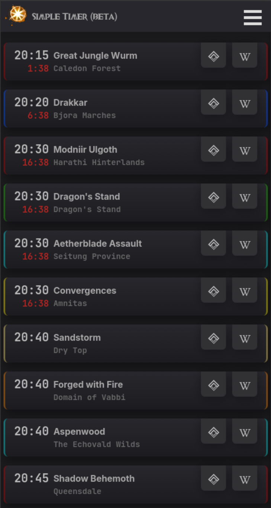

# GW2 Simple Timer

## A Simple GuildWars2 Meta Event Timer

---

For one, I built this timer as a hobby project to learn how to code.
And secondly, because none of the timers already in existence have the use case I wanted, or they didn't cover the latest game expansions.

The timer is intended to stick on a second monitor.
To keep an eye on what happens next, in the fantastic world of Tyria.

#### Visit
Website: https://gw2simpletimer.netlify.app/  
current testing Live Demo: https://master-demo-gw2timer.netlify.app/

## Features

---
- Copy Wayponit to Clipboard
- hide Events you are not interested in
- Set a visual and audible alert 2, 5 or 10 Minutes before an Events begins
- Mark an Event as done (will restet with in game server reset)
- "Done Marker" and hidden Events gets Saved for your future visit

## Known issues

---
- missing Festival events

## Roadmap

---
- add missing events
- let user choose how far in advance events are displayed
- let user choose how far in advance the countdown is displayed
- UI/UX improvement
- set "Done Marker" via a user provided API key
- include Farm train Discord notifications - maybe if possible

